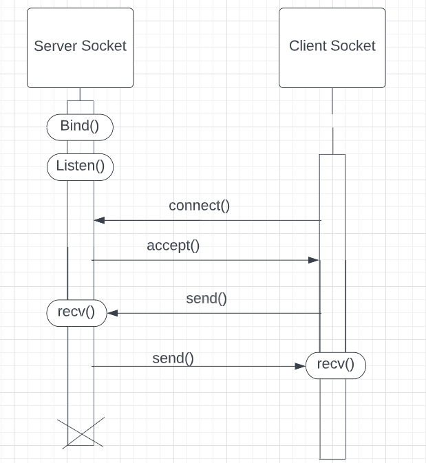

# Microservice for Outlook

# Communication Contract
A. Clear instructions for how to REQUEST data from the microservice you implemented. Include an example call.

The microservice uses sockets implemented with python's socket module in order to communicate with the client program. 
In order to request data, the microservice (server.py) should be running locally and using localhost as the host and any port within 
the range 1024-65535. The host and port must be the same in the client program. Once the microservice is running, the client
can create a socket object that connects to the server.

Once the connection has been established the client can send a message to the server.
The message should be in json format.

If a "save" request is being made then the json text should be in the following format:

{ "action" : "save", "path" : "name_of_file_to_save.txt", "info" : "financial information to be saved" }

If a "load" request is being made then the json text should be in the following format:

{ "action" : "load", "path" : "name_of_file_to_upload_from.txt" }

The socket will then send this information as bytes, encoded in utf-8 to be recieved by the microservice. The message cannot
be longer than 1024 bytes. 

Example Call: User wants to save "You have 1 million dollars" to the file outlook.txt

````
client_info =  {"action": "save", "path": "outlook.txt", "info": "You have 1 million dollars"}

client_info_json = json.dumps(client_info)

with socket.socket(socket.AF_INET, socket.SOCK_STREAM) as s:
    s.connect((127.0.0.1, 54290)) #connects to the server at the host/port
    s.sendall(bytes(client_info_json, encoding="utf-8"))
````

B. Clear instructions for how to RECEIVE data from the microservice you implemented

If a "save" request was made to the microservice, a text file in the same directory as the program (unless another path is specified)
will be created. The microservice will send back a message in the format

{ "status" : "Success or Failure" } 

to indicate if the file creation was successful or not. If a "load" request was called then the program will send back 
the information in the following format as bytes

{ "info" : "contents of the specified txt file" }. 

To receive these messages the client should have a receive function in the socket implemented
after the sendall function as follows:

```
    # 1024 is specified as the max amount of bytes that can be recieved at once
    data = s.recv(1024) # recieves message from server and store in variable
    data = data.decode("utf-8") # decode message
    data = json.loads(data) # change from json back into python dictionary
```

Since the data was sent as bytes and encoded with "utf-8" it needs to be decoded and converted from back to a python dictionary.

C. UML sequence diagram

